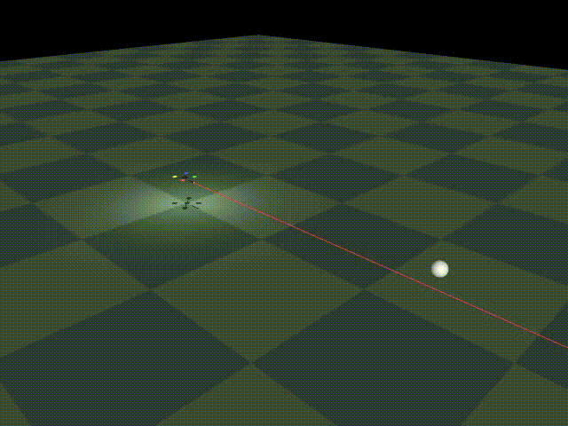
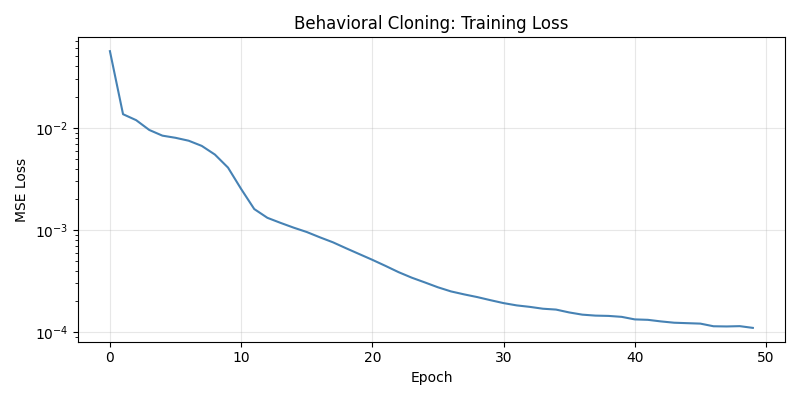
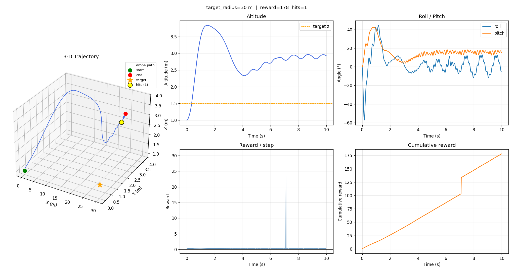

# Limitanei: Counter-UAS Drone RL Simulation

A physics-accurate reinforcement learning environment built in MuJoCo for an autonomous counter-drone project. A PPO agent learns to navigate to and engage a (currently stationary) aerial target while compensating for high-frequency recoil from an onboard weapon. The simulation studies whether a learned control policy can maintain stable flight during weapon discharge, a core challenge for modern autonomous interceptor platforms. See [Run It](#run-it) to try the simulation or evaluate trained models.



*PPO agent engaging a target at 10 m after ~2M training timesteps.*

---

## Stack

- **MuJoCo 3** — physics engine (rigid body dynamics, ray casting, collision)
- **Stable-Baselines3** — PPO implementation
- **PyTorch** — behavioral cloning, custom policy network
- **Gymnasium** — environment API
- **NumPy / Matplotlib** — data collection and visualization

---

## What's Implemented

### Simulation Core

A physics-accurate quadrotor simulator built on MuJoCo:

- **6-DOF rigid body dynamics** with quaternion-based orientation (no gimbal lock)
- **Cascaded PID controller** (250 Hz): outer position loop → desired attitude → inner attitude loop → per-rotor torques, with gravity-cancel feedforward and anti-windup integrators
- **X-frame mixer**: converts desired wrench `(T_total, τ_x, τ_y, τ_z)` to four rotor thrust commands via precomputed 4×4 matrix inverse
- **Motor first-order lag** (`τ = 0.05 s`): discrete filter approximating real motor RPM dynamics
- **Stochastic disturbances**: Ornstein-Uhlenbeck wind gusts + per-shot recoil noise (magnitude and angle)
- **Projectile ballistics**: Python-side drag integration for 360–940 m/s rounds (too fast for MuJoCo collision at 2 ms timestep); ray-cast hit detection at moment of fire
- **Spent casing physics**: pre-allocated MuJoCo rigid body pool with propeller-impact detection
- **Payload catalog**: 8 kinetic payloads (Glock 18 to M134) with physics-derived recoil forces (62–776 N average)
- **Trajectory recorder**: writes full sim state to `.npz` for offline replay and analysis

### Gymnasium Environments

Two Gymnasium-compatible environments wrapping the simulator:

| Environment | Task | Observation (15-dim) | Action (5-dim) |
|---|---|---|---|
| `ZeroTargetEnv` | Hover stabilization | altitude, quat, vel, ω, ammo, target_rel | 4× rotor thrust + fire |
| `SingleTargetEnv` | Navigate and engage one stationary target | same | same |

Both support `control_level='thrust'` (direct per-rotor commands, RL must learn to hover) and `control_level='setpoint'` (RL outputs position setpoints, onboard PID flies the drone).

**Reward shaping (`SingleTargetEnv`):**
- Per-hit reward + always-on cosine aiming bonus (prevents never-shoot local optima)
- Shot-shaping: `clip(miss_dist / d_perp, 0, 1)` per shot — dense signal before hits land
- Stability penalty on roll² and pitch excess²
- Minimum approach distance penalty (prevents degenerate point-blank solutions)
- Crash penalty

### Policy Architecture

A split two-stream MLP (`drone_sim/rl/networks.py`) designed for weight transfer between training stages:

```
obs (15-dim)
 ├─ flight_enc : obs[0:12]  →  Linear(12, 64) → Tanh → 64
 └─ target_enc : obs[12:15] →  Linear(3, 16)  → Tanh → 16
                                                         │ concat → 80
                              policy_net: Linear(80,64) → Tanh → Linear(64,64) → Tanh → 64
                              action_head: Linear(64, 5)
```

The split keeps the flight and target encoders independent so `flight_enc` trained on hover data is not disturbed when `target_enc` is trained on engagement data. Architecture mirrors SB3's `MlpPolicy` layout exactly, enabling direct weight transfer without re-wrapping.

---

## Experiments

Training followed a three-stage pipeline, each building on the previous.

### Experiment −1 — Behavioral Cloning Pretraining

**Problem:** A randomly initialised PPO policy crashes at step ~43 — episodes are too short for any reward signal. PPO can't bootstrap from nothing.

**Approach:** Supervised pretraining (behavioral cloning) from the cascaded PID.

1. **Dataset generation** — 100,000 drone states sampled analytically from a Gaussian distribution centred on the hover point. No simulation needed; the PID is queried on each state to produce the expert action (4 rotor thrusts + fire=−1).

2. **Network training** — The `SplitHoverPolicy` (10,565 parameters) trained with MSE loss for 50 epochs, converging to loss ~1.1×10⁻⁴. Mean predicted thrust (−0.677) matches the analytic hover thrust (−0.681).

3. **Weight transfer** — Weights copied layer-by-layer into a freshly created SB3 `PPO` model. BC network and SB3 actor outputs agree to <10⁻⁶ on a hover observation.

**Result:** PPO episodes go from ~43 steps (crash) to 500 steps (full episode) immediately after weight transfer, before any PPO gradient steps.



---

### Experiment 0 — PPO Stabilization

**Problem:** Confirm the BC-pretrained policy can be fine-tuned with PPO before introducing the harder engagement task.

**Approach:** PPO fine-tuning on `ZeroTargetEnv` from the BC checkpoint. Low learning rate (5e-6), `ent_coef=0.01`, initial `log_std=−2.0` to keep the policy near its BC mean early in training.

**Result:** Agent maintains stable hover for full 500-step episodes with consistent positive reward.

---

### Experiment 1 — Curriculum RL for Target Engagement

**Problem:** The HK416's average recoil (79 N) exceeds the drone's own weight (57 N loaded). The policy must simultaneously navigate to a target, aim, fire, and recover from each recoil impulse. The task is too hard to learn from scratch or from a fixed-distance target. 

**Approach:** Distance curriculum PPO fine-tuned from the BC hover checkpoint.

**Fire cold-start fix:** The BC policy learned fire=−1 (never fire) because discharging during hover training would crash every episode. Before the PPO engagement stage, the fire output head is manually reset: weight row zeroed, bias set to +1, log_std set to 0 → P(fire > 0) ≈ 84.1%. Hover weights are untouched.

**Curriculum stages:**

| Stage | Key reward changes |
|---|---|
| 5 m  | hit=75, aim=0.03, miss_dist=0.05, stability=0.01 |
| 20 m | + min_dist penalty (5 m floor) |
| 30 m | hit=100, sparse reward (aim/ammo/stability → 0) |

Each stage loaded the previous checkpoint and continued training. Target spawn heading fixed to `toward_target` throughout.

**Results:** Agent reliably engages targets at up to 30 m, approaching, hovering in the effective range zone, and firing while compensating for recoil.



Trained models: `experiments/experiment1/models/`

| Checkpoint | Description |
|---|---|
| `ppo_e1_5m_hk416.zip`    | 5 m curriculum stage |
| `ppo_e1_20m_hk416.zip`   | 20 m curriculum stage |
| `ppo_e1_30m_hk416.zip`   | 30 m curriculum stage |
| `ppo_e1_30m_hk416_b.zip` | 30 m, continued with sparse reward |

---

## Run It

### Interactive simulation (PID controller, no RL)

```bash
# Autonomous intercept (drone engages threat coordinates):
python main.py --mode auto

# Pilot it yourself with a different payload:
python main.py --mode keyboard --gun pkm

# List all payload options and ballistic stats:
python main.py --list-guns

# Full disturbances + projectile tracers + reproducible seed:
python main.py --gun hk416 --targets 5 --aim-yaw --projectiles \
               --seed 42 --recoil-noise 0.04 --wind 4 0 0 --gust 1.0
```

Keyboard mode uses **the numeric keypad** (NumLock ON):

```
7 yaw-L     8 fwd      9 yaw-R
4 strafe-L  5 RESET    6 strafe-R
            2 back
+  climb               -  descend
0  ENGAGE
```

### Evaluate and visualize trained RL models

```bash
# Live MuJoCo viewer — 30 m target, real-time playback:
python eval.py experiments/experiment1/models/ppo_e1_30m_hk416_b.zip

# Slow down to 50% for closer inspection:
python eval.py experiments/experiment1/models/ppo_e1_30m_hk416_b.zip --speed 0.5

# Headless — print per-step stats and save reward plot (no viewer needed):
python eval.py experiments/experiment1/models/ppo_e1_30m_hk416_b.zip --headless

# Save an MP4 video (requires opencv-python):
python eval.py experiments/experiment1/models/ppo_e1_30m_hk416_b.zip --save-video flight.mp4

# Evaluate a closer curriculum stage:
python eval.py experiments/experiment1/models/ppo_e1_5m_hk416_b.zip --target-radius 5

# Hover-only model (ZeroTargetEnv):
python eval.py experiments/experiment0/ppo_e0_thrust.zip --env zero

# Full option list:
python eval.py --help
```

`eval.py` prints a per-step reward table, episode summary (steps / total reward / hits), and saves a trajectory + cumulative reward plot. With `--save-video` it renders an offscreen MP4 via MuJoCo's renderer.

### Record and replay a flight

```bash
python main.py --gun hk416 --targets 5 --aim-yaw --mode auto --record flight.npz
python replay.py flight.npz
python replay.py flight.npz --speed 0.25
```

---

## File Structure

| File / Directory | Role |
|---|---|
| [eval.py](eval.py) | CLI for evaluating and visualizing trained RL models |
| [main.py](main.py) | Builds MuJoCo XML from config, runs the sim + PID control + payload loop |
| [replay.py](replay.py) | Plays back a recorded `.npz` flight |
| [drone_sim/rl/env.py](drone_sim/rl/env.py) | Base `DroneEnv` Gymnasium environment |
| [drone_sim/rl/custom_envs.py](drone_sim/rl/custom_envs.py) | `ZeroTargetEnv` and `SingleTargetEnv` with shaped rewards |
| [drone_sim/rl/networks.py](drone_sim/rl/networks.py) | `SplitExtractor` two-stream MLP for SB3 |
| [drone_sim/rl/viz.py](drone_sim/rl/viz.py) | `visualize_episode`: MuJoCo viewer + trajectory plots + optional video export |
| [drone_sim/rl/callbacks.py](drone_sim/rl/callbacks.py) | `ShotStatsCallback` for per-episode hit/shot logging during PPO |
| [drone_sim/control/controller.py](drone_sim/control/controller.py) | Cascaded position + attitude PID + X-frame rotor mixer |
| [drone_sim/control/modes.py](drone_sim/control/modes.py) | Setpoint generators: keyboard pilot, autonomous intercept loop |
| [drone_sim/physics/gun.py](drone_sim/physics/gun.py) | `Gun` class + payload catalog with physics-derived recoil parameters |
| [drone_sim/physics/disturbances.py](drone_sim/physics/disturbances.py) | Ornstein-Uhlenbeck wind, aerodynamic drag, per-shot recoil noise |
| [drone_sim/physics/bullets.py](drone_sim/physics/bullets.py) | Projectile ballistics + tracer rendering |
| [drone_sim/physics/casings.py](drone_sim/physics/casings.py) | Spent-casing MuJoCo body pool + propeller-impact detection |
| [drone_sim/physics/targets.py](drone_sim/physics/targets.py) | Aerial threat targets, ray-cast hit detection, multi-pellet spread |
| [drone_sim/config.py](drone_sim/config.py) | All tunable constants (drone, controller, sim, payload, disturbances) |
| [experiments/](experiments/) | Training notebooks and saved model checkpoints |
| [docs/physics.md](docs/physics.md) | Full physics derivations (rotor model, PID, recoil, disturbances) |
